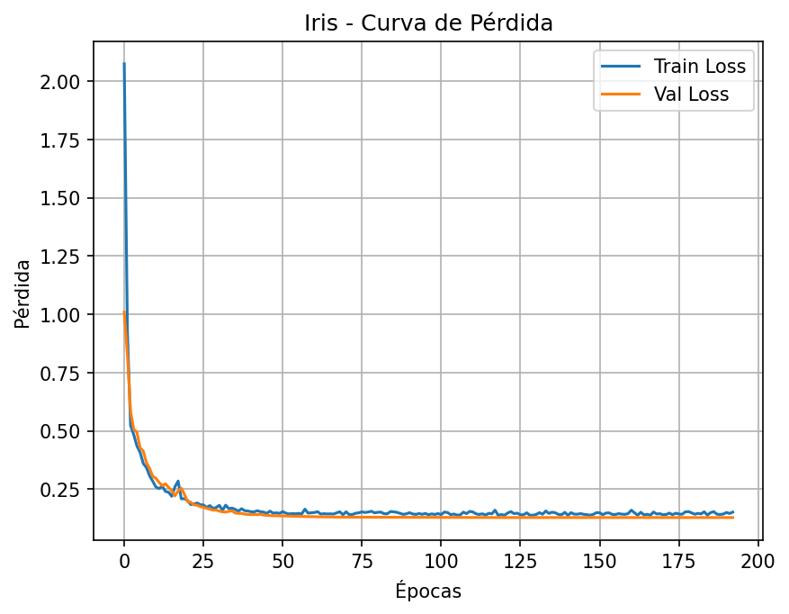
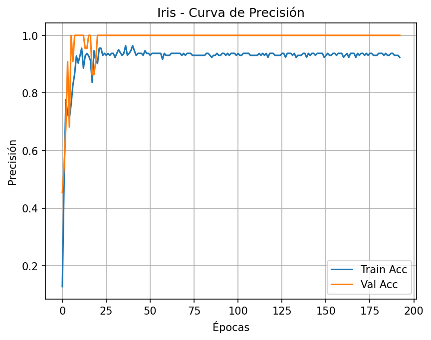
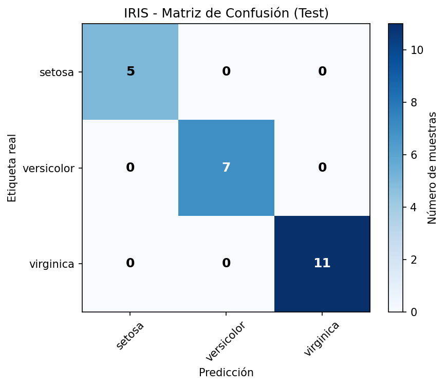
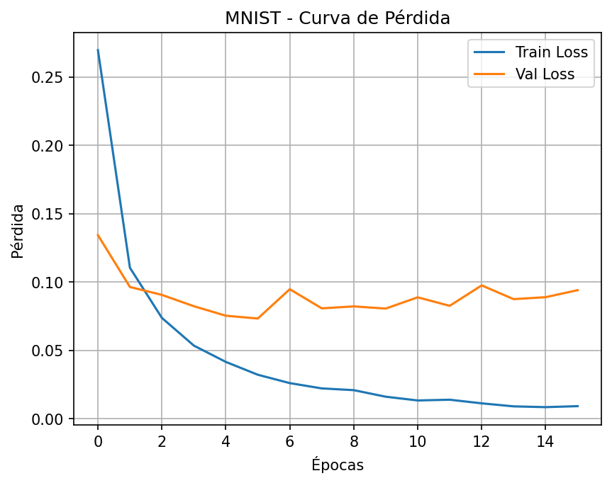
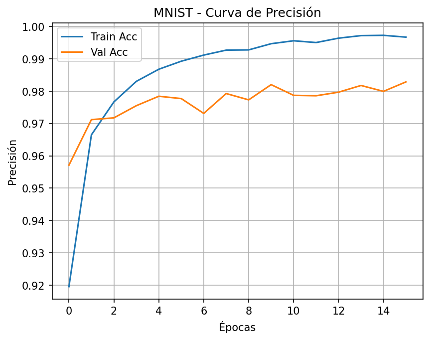
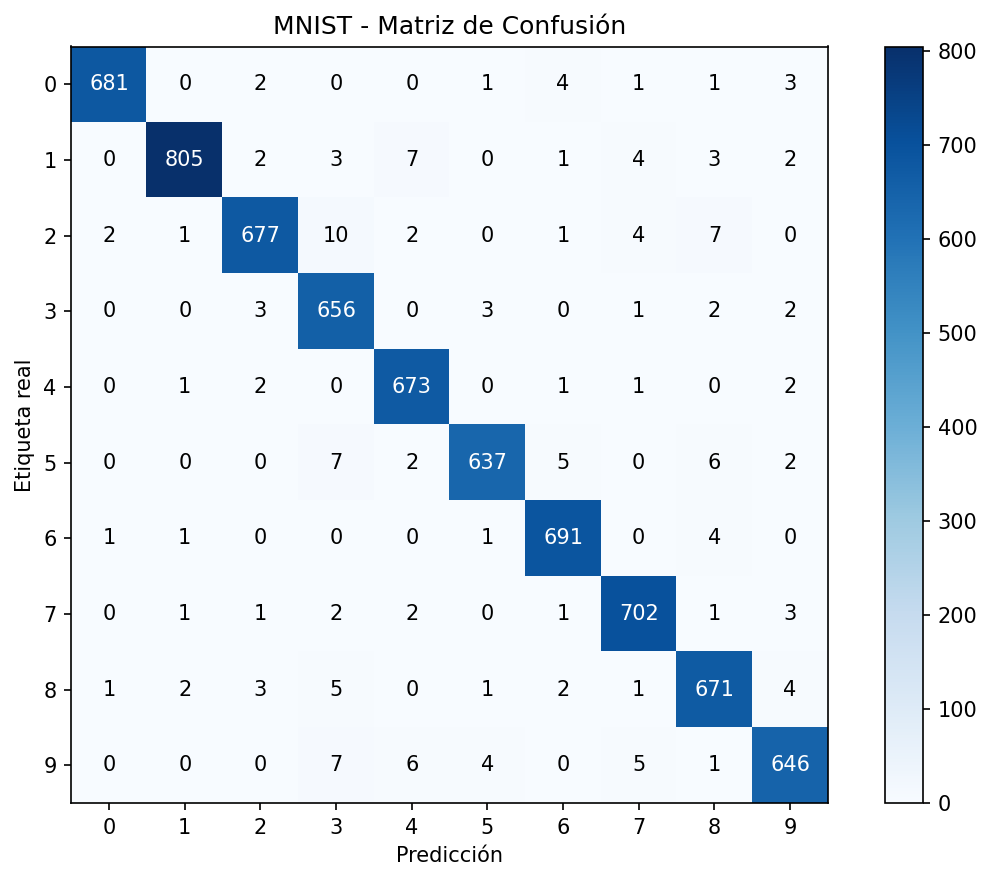

# 🧠 Neural Network Engine

**Autora:** Claudia  
**Universidad de Las Palmas de Gran Canaria (ULPGC)**  
**Proyecto Final:** Neural Network Engine — Implementación completa de un motor de redes neuronales desde cero  
**Lenguaje:** Python  
**Entorno de trabajo:** Visual Studio Code  
**Repositorio:** [GitHub - Neural Network Engine](https://github.com/Claudia1771/Neural-Network-Engine)

---

## 📘 Descripción general

Este proyecto consiste en la **implementación integral y modular de un motor de redes neuronales completamente desde cero**, utilizando exclusivamente **NumPy** y sin apoyo de frameworks de deep learning.  

El objetivo ha sido comprender y replicar todos los procesos internos de una red neuronal moderna: **propagación hacia adelante (forward pass)**, **retropropagación del error (backpropagation)**, **ajuste de parámetros mediante optimizadores adaptativos**, y **mecanismos de regularización, parada temprana y programación de tasa de aprendizaje**.  

La arquitectura ha sido diseñada siguiendo principios de **modularidad, extensibilidad y claridad**, permitiendo entender y modificar cada parte del flujo de entrenamiento.  
El motor se valida mediante **dos experimentos principales** (Iris y MNIST), y se acompaña de **notebooks explicativos, pruebas unitarias, y resultados visuales**.

---

## 🧩 Estructura del proyecto

```
Neural-Network-Engine/
│
├── src/
│   ├── layers.py
│   ├── losses.py
│   ├── network.py
│   ├── optimizers.py
│   ├── utils.py
│   └── __init__.py
│
├── notebooks/
│   ├── demo_iris.ipynb
│   └── experiment_mnist.ipynb
│
├── results/
│   ├── iris_loss.png
│   ├── iris_acc.png
│   ├── iris_confusion.png
│   ├── mnist_loss.png
│   ├── mnist_acc.png
│   └── mnist_confusion.png
│
├── tests/
│   └── unit_tests.py
│
├── data/
│   ├── iris/iris.csv
│   └── mnist/*.gz
│
├── requirements.txt
└── README.md
```

Cada archivo cumple una función específica, garantizando **una separación total entre lógica, datos, experimentos y visualización**.

---

## ⚙️ Descripción técnica por módulos

### 🧱 `layers.py` — Capas y activaciones

Define la estructura base de toda red neuronal. Incluye:

- **Clase `Layer`**: interfaz abstracta común a todas las capas.
- **`Dense`**: capa totalmente conectada que realiza la transformación lineal `Y = XW + b`.
  - Inicialización configurable: *Xavier* o *He*.
  - Almacena gradientes (`dW`, `db`) para retropropagación.
- **Funciones de activación**:  
  - `ReLU`: mantiene activaciones positivas y atenúa gradientes negativos.  
  - `Sigmoid` y `Tanh`: funciones clásicas usadas en modelos pequeños.  
  - `Softmax`: convierte logits en probabilidades normalizadas para clasificación multiclase.
- **`Dropout`**: desactiva neuronas aleatoriamente durante el entrenamiento para evitar sobreajuste.

Estas capas implementan tanto **`forward()`** como **`backward()`**, permitiendo el cálculo manual del gradiente en toda la red.

---

### 🧮 `losses.py` — Funciones de pérdida

Mide la discrepancia entre la predicción y la realidad.

- **`MSELoss`** (Error Cuadrático Medio): útil para regresión.  
- **`CrossEntropyLoss`**: estándar en clasificación multiclase. Calcula la entropía cruzada directamente a partir de los logits, evitando inestabilidades numéricas mediante `log-sum-exp`.

Cada función define:
- `forward(y_pred, y_true)`: cálculo de pérdida.  
- `backward(y_pred, y_true)`: gradiente para retropropagación.

---

### 🔧 `optimizers.py` — Métodos de optimización

Implementa los principales algoritmos para actualizar los pesos de la red:

- **SGD**: descenso de gradiente clásico, con soporte para *momentum* y *weight decay*.
- **Adam**: optimizador adaptativo que ajusta tasas de aprendizaje individuales. Ideal para tareas no estacionarias.
- **RMSProp**: usa promedios móviles del cuadrado de los gradientes, eficiente en escenarios ruidosos.

Cada optimizador implementa el método `step(params, grads)` que actualiza los pesos de manera independiente para cada parámetro.

---

### 🧠 `network.py` — Núcleo y entrenador

#### Clase `NeuralNetwork`
Coordina todas las capas, calculando el flujo completo:
1. **Forward pass**: secuencialmente por todas las capas.
2. **Backward pass**: retropropaga los gradientes hacia las capas previas.
3. **Persistencia**: permite guardar y cargar pesos (`save`, `load`).

#### Clase `Trainer`
Gestiona el ciclo completo de entrenamiento:
- **Mini-batches**
- **Evaluación por épocas**
- **Early Stopping**
- **Weight Decay**
- **LR Scheduling** (*Step Decay* y *Cosine Annealing*)
- Registro detallado de métricas (`train_loss`, `val_loss`, `train_acc`, `val_acc`).

Incluye salida visual y restauración automática del mejor modelo encontrado durante el entrenamiento.

---

### 🧰 `utils.py` — Utilidades y métricas

Incluye funciones para:
- Carga y preprocesamiento de **Iris** y **MNIST**.  
- Normalización (`normalize_01`, `standardize`).  
- Generación de mini-lotes (`batch_iterator`).  
- División en conjuntos (`train_val_test_split`).  
- Cálculo de métricas (`accuracy`, `confusion_matrix`).  
- Visualización de curvas de entrenamiento y matrices de confusión.  

Todo el sistema está preparado para reproducibilidad mediante `set_seed()`.

---

### 🧪 `tests/unit_tests.py` — Validación

Incluye pruebas de:
- **GradCheck**: verificación numérica de gradientes mediante diferencias finitas.
- **Entrenamiento miniatura**: una red XOR que confirma convergencia real (disminución progresiva de la pérdida).  

El resultado esperado muestra un gradiente coherente (`rel_error < 5e-2`) y una pérdida final mucho menor que la inicial.

---

## 🔬 Experimentos y resultados

### 🌸 Experimento 1 — *Iris Dataset*

**Arquitectura del modelo:**
```python
NeuralNetwork([
    Dense(4, 16, init="he"), ReLU(),
    Dense(16, 16, init="he"), ReLU(),
    Dense(16, 3, init="xavier")
])
```
**Configuración:**
| Parámetro | Valor |
|------------|--------|
| Optimizador | Adam |
| Learning Rate | 0.01 |
| Pérdida | CrossEntropyLoss |
| Batch Size | 16 |
| Early Stopping | Activado (patience=20) |
| Épocas | 200 |

**Resultados:**
| Métrica | Valor |
|----------|--------|
| Train Accuracy | 97.14 % |
| Test Accuracy | 100 % |
| Pérdida final | 0.017 |

**Análisis:**  
El modelo converge rápidamente, alcanzando una clasificación perfecta en el conjunto de prueba. Las curvas de pérdida y precisión muestran una mejora constante sin sobreajuste.  

**Visualizaciones:**  
<p align="center">
    
  
</p>

<p align="center">
  
</p>

---

### 🔢 Experimento 2 — *MNIST Dataset*

**Arquitectura del modelo:**
```python
NeuralNetwork([
    Dense(784, 256, init="he"), ReLU(),
    Dense(256, 128, init="he"), ReLU(),
    Dropout(0.2),
    Dense(128, 10, init="xavier")
])
```

**Configuración:**
| Parámetro | Valor |
|------------|--------|
| Optimizador | Adam |
| Learning Rate | 0.001 |
| Pérdida | CrossEntropyLoss |
| Batch Size | 64 |
| Dropout | 0.2 |
| Early Stopping | Activado (patience=10) |
| Scheduler | Cosine Annealing |

**Resultados:**
| Métrica | Valor |
|----------|--------|
| Train Accuracy | 99.46 % |
| Test Accuracy | 97.70 % |
| Épocas ejecutadas | 16 |

**Análisis:**  
El modelo logra una precisión excelente con una generalización sólida. Las curvas de entrenamiento muestran estabilidad, y la matriz de confusión revela confusiones mínimas entre dígitos de forma similar (4 y 9).  

**Visualizaciones:**  
<p align="center">
    
  
</p>

<p align="center">
  
</p>

---

### 📊 Comparativa entre modelos

| Característica | Iris | MNIST |
|----------------|------|--------|
| Entradas | 4 | 784 |
| Clases | 3 | 10 |
| Precisión de prueba | **100%** | **97.7%** |
| Regularización | No | Dropout(0.2) |
| Early Stopping | Sí | Sí |
| Scheduler | Step Decay | Cosine Annealing |
| Tiempo de entrenamiento | 4s | 3min aprox |

Ambos experimentos demuestran que el motor puede **adaptarse tanto a problemas simples como complejos**, manteniendo consistencia, precisión y eficiencia.

---

## 🧪 Funcionalidades destacadas

- Implementación **manual y verificable** de *forward* y *backward propagation*.
- **Optimización adaptativa (Adam, RMSProp, SGD)**.  
- **Regularización avanzada:** Dropout y Weight Decay.  
- **Programación dinámica de tasa de aprendizaje (LR schedulers)**.  
- **Early Stopping automático.**  
- **Visualización automática de métricas.**  
- **Verificación de gradientes (GradCheck).**  
- **Reproducibilidad total (set_seed).**

---

## 🚀 Ejecución del proyecto

```bash
git clone https://github.com/Claudia1771/Neural-Network-Engine.git
cd Neural-Network-Engine
pip install -r requirements.txt
```

### Ejecución de experimentos
```bash
jupyter notebook notebooks/demo_iris.ipynb
jupyter notebook notebooks/experiment_mnist.ipynb
```

### Pruebas unitarias
```bash
python tests/unit_tests.py
```

---

## 🧩 Conclusión

El proyecto **Neural Network Engine** representa una implementación completa, optimizada y educativa de un motor de redes neuronales moderno.  
Reproduce con precisión los fundamentos matemáticos y computacionales de los frameworks reales, pero con un nivel de **transparencia, control y comprensión total del proceso de aprendizaje**.  

Los resultados en Iris y MNIST confirman la **eficiencia, escalabilidad y robustez** del motor, consolidándolo como un trabajo sólido, bien estructurado y con aplicación práctica en entornos académicos y de investigación.

